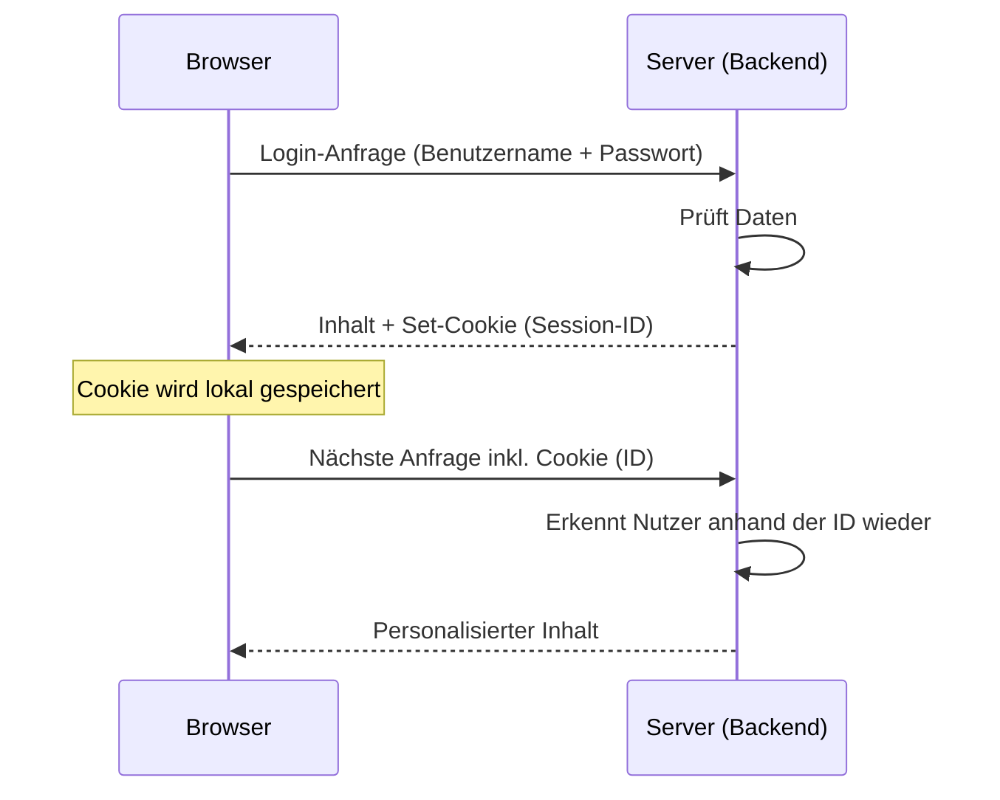
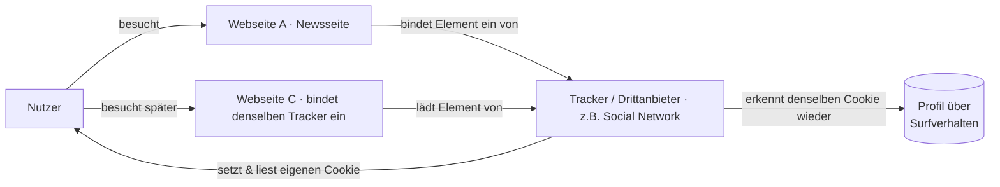

# Cookies auf Internetseiten

> Lernnotizen: Was Cookies sind, wie sie funktionieren, wie sie uns verfolgen, wozu sie dienen und wie man sich schützt. Inklusive der rechtlichen Einordnung für EU und Schweiz.

---

## 1. Was sind Cookies?

**Frage:** *Was sind Cookies und wofür waren sie eigentlich gedacht?*

- Ein Cookie ist eine **kleine Textdatei**, die eine Webseite über den Browser **lokal auf dem Gerät des Nutzers** speichert.
- Sie speichern Zustände oder kleine Datenmengen – z. B. eine Warenkorb-Kennung, ein Login-Status oder Einstellungen.
- **Ursprünglicher Zweck:** Der Server muss sich den Zustand eines Nutzers **nicht selbst merken**. Statt für jeden Besucher Serverspeicher zu belegen, liegt die Zustandsinformation (bzw. eine ID darauf) beim Nutzer. → spart Serverressourcen.

> **Präzisierung:** Im Cookie steht meist **nicht** der ganze Warenkorb, sondern nur eine **ID/Session-ID**. Der eigentliche Warenkorb liegt im Backend und wird über diese ID zugeordnet. Das schont Speicher *und* Sicherheit (sensible Daten bleiben auf dem Server).

---

## 2. Wie Cookies funktionieren

**Frage:** *Wie funktionieren Cookies technisch?*

- Das **HTTP-Protokoll ist „stateless"** – jede Anfrage steht für sich, der Server „vergisst" nach jeder Anfrage, wer du bist.
- Cookies umgehen genau dieses Problem und schaffen **Zustand über mehrere Anfragen hinweg**.

### Ablauf am Beispiel Login

1. Der Browser sendet **Login-Daten** (Benutzername + Passwort) an den Server.
2. Der Server **prüft die Daten im Backend**.
3. Bei Erfolg schickt der Server den Inhalt **plus einen `Set-Cookie`-Header** (enthält eine Session-ID) zurück.
4. Der Browser **speichert diesen Cookie** lokal.
5. Bei **jeder weiteren Anfrage** sendet der Browser den Cookie automatisch mit → der Server **erkennt den Nutzer anhand der ID** wieder.
6. So bleiben Login, Einstellungen und Konfigurationen über die Zeit „bestehen".

### Grenzen von Cookies

| Grenze | Klassischer RFC-Wert (Mindestvorgabe) | Moderne Browser (real) |
|---|---|---|
| Grösse **pro Cookie** | 4096 Byte (~4 KB) | weiterhin ~4 KB |
| Cookies **pro Domain** | 20 (Mindestempfehlung) | Chrome/Edge ~180 · Firefox ~150 · Safari ~50 |
| Cookies **gesamt** | 300 | mehrere Tausend |

> **Korrektur zu deinen Notizen:** Die Werte „max. 300 Cookies" und „20 pro Domain" stammen aus den alten RFCs (2109/2965/6265) und waren **Mindestvorgaben**, die ein Browser mindestens unterstützen *sollte* – **keine harten Obergrenzen**. Moderne Browser liegen deutlich darüber. Nur das **~4 KB pro Cookie** stimmt bis heute.
>
> **Wenn das Limit voll ist:** Die meisten Browser werfen den **ältesten Cookie** raus (LRU-Prinzip), um Platz zu schaffen.

- **Domainbindung:** Ein Cookie gilt grundsätzlich nur für die Domain, die ihn gesetzt hat (Same-Origin). Er wird nicht einfach an fremde Webseiten geschickt.

---

## 3. Wie Cookies uns verfolgen

**Frage:** *Wie können Cookies über mehrere Seiten hinweg tracken?*

- Ein Cookie von **Webseite A** kann eigentlich **nicht** auf **Webseite B** ausgelesen werden.
- **Aber:** Webseite B kann Inhalte von Webseite A **einbetten** (z. B. Like-Button, Werbebanner, eingebettetes Video, Font, Pixel).
- Dadurch **kommuniziert dein Browser direkt mit A**, sobald du B besuchst – und schickt dabei den Cookie von A mit.
- Ergebnis: **A (der Dritt-Anbieter) erkennt dich auf B, C, D …** wieder und baut so ein **seitenübergreifendes Profil** deines Surfverhaltens auf.

Das sind die berüchtigten **Third-Party-Cookies** (Cookies eines Drittanbieters, der auf vielen Seiten eingebunden ist).

> **Gegenbewegung:** **Safari, Firefox und Brave** blockieren Third-Party-Cookies standardmässig. **Chrome** erlaubt sie noch, aber ihre Bedeutung nimmt insgesamt ab (Alternativen: Fingerprinting, serverseitiges Tracking – daher ist Blockieren allein kein vollständiger Schutz).

---

## 4. Ziel von Cookies

**Frage:** *Wozu werden Cookies eingesetzt?*

- **Daten sammeln** für gezielte Werbung (Profiling).
- **Datenverkauf** an Werbenetzwerke / Datenhändler.
- **Funktion sicherstellen** – z. B. dass der Login nicht bei jeder Anfrage vergessen wird → **Session-Cookies**.

### Cookie-Typen im Überblick

| Typ | Beispiel | Einwilligung nötig? (EU) |
|---|---|---|
| **Notwendige / technische** Cookies | Login-Session, Warenkorb, CSRF-Schutz | Nein |
| **Funktionale** Cookies | Sprache, Theme, gespeicherte Filter | Empfohlen |
| **Statistik / Analyse** | Google Analytics, Matomo | Ja (i. d. R.) |
| **Marketing / Tracking** | Meta Pixel, Google Ads | Ja (zwingend) |

Weitere nützliche Unterscheidungen:

- **Session-Cookie** → wird beim Schliessen des Browsers gelöscht (kein `Expires`/`Max-Age`).
- **Persistenter Cookie** → bleibt bis zum Ablaufdatum oder manuellem Löschen.
- **First-Party** (von der besuchten Seite) vs. **Third-Party** (von einem eingebundenen Drittanbieter → siehe Tracking).

---

## 5. Wie man sich gegen Cookies schützen kann

**Frage:** *Welche Schutzmöglichkeiten gibt es?*

**Technisch:**
- **Datenschutzfreundliche Browser** – z. B. **Safari**, **Brave**, **Firefox** (blockieren Third-Party-Tracking standardmässig).
- **Browser-Extensions** – z. B. uBlock Origin, Privacy Badger.
- Cookies regelmässig **löschen**, **Inkognito-Modus** nutzen, Third-Party-Cookies in den Browsereinstellungen **deaktivieren**.

**Rechtlich:**

> **Wichtige Korrektur zu deinen Notizen:** Nicht die **DSGVO** (engl. GDPR) ist das eigentliche „Cookie-Gesetz". Der Banner-/Einwilligungszwang kommt aus der **ePrivacy-Richtlinie (2002/58/EG, geändert 2009)** – der sogenannten *„Cookie-Richtlinie"*. Die **DSGVO** ergänzt sie: Sie definiert, **was eine gültige Einwilligung ist**, und stuft Cookie-Kennungen als **Personendaten** ein. Beide greifen **zusammen**.

- Grundprinzip in der EU: **Opt-in** – nicht-notwendige Cookies dürfen **erst nach aktiver Einwilligung** gesetzt werden.
- Ausnahme: **Strikt notwendige** Cookies brauchen keine Einwilligung (aber Info-Pflicht bleibt).

### EU vs. Schweiz

| Aspekt | EU | Schweiz |
|---|---|---|
| Massgebliche Norm | ePrivacy-Richtlinie + DSGVO | revDSG (nDSG) + Fernmeldegesetz (FMG, Art. 45c) |
| Grundprinzip | **Opt-in** (Einwilligung *vor* nicht-notwendigen Cookies) | traditionell nur **Information** (Infobanner), Opt-out über Browser genügt |
| Banner gesetzlich Pflicht? | Ja, für nicht-notwendige Cookies | Gesetzlich **nicht zwingend** – aber siehe EDÖB unten |
| Sanktion | bis **20 Mio. €** oder 4 % Jahresumsatz (gegen das **Unternehmen**) | bis **CHF 250'000** – gegen die verantwortliche **natürliche Person** |

> **Aktuelle Entwicklung Schweiz:** Der **EDÖB** hat seit **Januar 2025** (aktualisiert Okt 2025) Leitlinien veröffentlicht, die die Anforderungen näher an die EU rücken: gleichwertige Buttons für *„Akzeptieren"* und *„Ablehnen"*, granulare Auswahl, jederzeitiger Widerruf, **keine Dark Patterns**. Für nicht-notwendige Cookies (Tracking/Werbung) kann damit faktisch eine Einwilligung erforderlich werden. Ob das rechtlich zwingend ist, wird noch kontrovers diskutiert – wer aber **EU-Nutzer gezielt anspricht**, muss ohnehin DSGVO-konform (Opt-in) arbeiten.

---

## Bezug zum Banner im Anhang

Der abgebildete Banner (*„Diese Webseite verwendet Cookies…"*) bietet nur **„Akzeptieren"** und **„Datenschutz"** – im sichtbaren Bereich **kein gleichwertiges „Ablehnen"**.

- Nach **EU-Recht** und den **neuen EDÖB-Leitlinien (2025)** gilt genau das als problematisch: Es braucht eine gleichwertige Ablehnen-Option auf derselben Ebene.
- Formulierungen wie „durch weitere Nutzung stimmen Sie zu" gelten **nicht** als gültige Einwilligung.

---

## Merksätze (Kurzzusammenfassung)

- HTTP ist **stateless** → Cookies schaffen **Zustand**.
- Im Cookie steckt meist nur eine **ID**, die Daten liegen im **Backend**.
- **4 KB pro Cookie** ist die reale Grenze; „300/20" sind veraltete RFC-**Mindestwerte**.
- **Tracking** entsteht über **eingebettete Dritt-Inhalte** (Third-Party-Cookies).
- Rechtsgrundlage EU = **ePrivacy-Richtlinie + DSGVO** (nicht DSGVO allein).
- Schweiz = **revDSG + FMG**: bisher **Information statt Einwilligung**, aber **EDÖB verschärft** Richtung EU. Sanktion trifft die **natürliche Person**.
