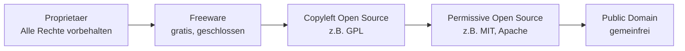

# Lizenzen und Open Source

> Lernnotizen: Was eine Lizenz ist, warum es sie gibt, worauf es Lizenzen gibt, welche Lizenzmodelle existieren, was Open Source bedeutet und der Unterschied zwischen Copyright und Copyleft.

---

## Aufgabe 1: Was bedeutet das Wort „Lizenz"?

- Der Begriff stammt vom lateinischen **„licentia"** = *Erlaubnis / Freiheit* (von *licere* = „erlaubt sein").
- Eine **Lizenz ist eine erteilte Erlaubnis**, etwas zu tun oder zu nutzen, das ohne diese Erlaubnis **nicht gestattet wäre**.
- Der **Lizenzgeber** (Rechteinhaber) räumt dem **Lizenznehmer** ein **Nutzungsrecht** ein – unter festgelegten Bedingungen (dem Lizenzvertrag / den Lizenzbedingungen).

> **Kernpunkt:** Man erwirbt in der Regel ein **Nutzungsrecht, kein Eigentum**. Man „besitzt" die Software (oder das Werk) nicht, man darf sie nur im Rahmen der Lizenz **verwenden**.

Das Wort hat zwei verwandte Bedeutungen:
- **Nutzungsrecht an geistigem Eigentum** (Software, Musik, Bild, Patent).
- **Behördliche Erlaubnis / Befähigung** (z. B. Führerschein, Pilotenlizenz, Gewerbelizenz).

---

## Aufgabe 2: Warum schafft man Lizenzen?

- **Schutz des geistigen Eigentums:** Der Ersteller behält die Kontrolle über sein Werk (Urheberrecht).
- **Monetarisierung ohne Eigentumsverlust:** Man verkauft **viele Nutzungsrechte** desselben Produkts, statt das Produkt selbst wegzugeben → skalierbares Geschäftsmodell.
- **Kontrolle über die Nutzung:** Festlegen, *wer* etwas *wie*, *wo* und *wie lange* nutzen darf (Einschränkungen, erlaubte Zwecke).
- **Rechtssicherheit:** Rechte und Pflichten beider Seiten sind klar geregelt; Haftung kann begrenzt werden.
- **Teilen und trotzdem Rechte behalten:** Auch Open Source funktioniert über Lizenzen – sie **gewähren gezielt Freiheiten**, statt sie zu verbieten.

> **Hintergrund:** Ohne Lizenz gilt standardmässig das Urheberrecht – Kopieren, Verändern und Verbreiten ist dann grundsätzlich **verboten**. Die Lizenz ist der Mechanismus, mit dem der Rechteinhaber diese Handlungen überhaupt erst **erlaubt**.

---

## Aufgabe 3: Worauf gibt es Lizenzen ausser für Software?

| Bereich | Beispiel |
|---|---|
| Musik & Filme | Streaming-Rechte, Radio-/Aufführungsrechte |
| Bilder & Fotos | Stock-Fotos, Creative-Commons-Bilder |
| Schriftarten (Fonts) | Desktop-, Web- und App-Font-Lizenzen |
| Texte & Bücher | Verlags- und Übersetzungsrechte |
| Patente & Technologien | Chip-Designs (z. B. ARM lizenziert an Hersteller) |
| Marken & Franchising | Restaurantketten, Merchandising |
| Behördliche „Lizenzen" | Führerschein, Pilotenlizenz, Gastro-/Alkohollizenz, Gewerbe |
| Medien-/Sendelizenzen | Rundfunk, Übertragungsrechte bei Sport |
| Games / In-Game-Inhalte | Nutzung von Spielinhalten, Engines (z. B. Unreal) |

> Kurz: Lizenziert wird alles, wofür jemand **Rechte** hält – nicht nur Software, sondern jede Form von geistigem Eigentum sowie behördlich geregelte Tätigkeiten.

---

## Aufgabe 4: Lizenzmodelle (Aufzählung)

| Modell | Kurzbeschreibung | Beispiel |
|---|---|---|
| **Proprietär / kommerziell** | Geschlossener Code, kostenpflichtig, alle Rechte beim Hersteller | Adobe Photoshop |
| **Freeware** | Gratis nutzbar, aber **geschlossen** (kein Quellcode, keine Änderung) | Zoom (Basis), viele Tools |
| **Shareware / Trial** | Kostenlos zum Testen, danach kostenpflichtig | Testversionen |
| **Freemium** | Basis gratis, erweiterte Funktionen kostenpflichtig | Spotify, viele Apps |
| **Abo / Subscription (SaaS)** | Laufende Gebühr, Nutzung solange man zahlt | Microsoft 365 |
| **Kauflizenz (Perpetual)** | Einmalkauf, dauerhafte Nutzung einer Version | ältere Office-Versionen |
| **Volumen- / Site-Lizenz** | Eine Lizenz für viele Geräte/Nutzer einer Organisation | Firmen-/Schullizenzen |
| **OEM-Lizenz** | An eine bestimmte Hardware gebunden | vorinstalliertes Windows |
| **Open-Source-Lizenz** | Quellcode offen, Nutzung/Änderung/Weitergabe erlaubt | Linux, Firefox |
| **Public Domain** | Gemeinfrei, keine Rechte vorbehalten | sehr alte Werke |
| **Creative Commons** | Baukasten für Inhalte (Bild/Text/Musik) mit Bedingungen | CC-BY, CC-BY-SA |

Häufige **technische Zählweisen** (wie eine Lizenz gemessen wird):
- **Per-Device** (pro Gerät), **Per-User / Named-User** (pro benannter Person),
- **Concurrent-User** (gleichzeitige Nutzer), **Per-Core / Per-Server** (in Rechenzentren).

---

## Aufgabe 5: Was bedeutet „Open Source"?

- **Der Quellcode ist offen zugänglich** – jeder kann ihn einsehen.
- Definiert wird der Begriff durch die **Open Source Initiative (OSI)**. Kern sind vier Freiheiten:

| Freiheit | Bedeutung |
|---|---|
| **Nutzen** | Für jeden Zweck einsetzen (auch kommerziell) |
| **Studieren** | Den Quellcode lesen und verstehen |
| **Verändern** | Anpassen, verbessern, eigene Versionen bauen |
| **Weitergeben** | Original oder veränderte Version verbreiten |

> **Wichtige Präzisierungen:**
> - **Open Source ist nicht dasselbe wie „kostenlos"** – meist gratis, aber der Fokus liegt auf der *Freiheit*, nicht auf dem Preis. Man darf mit Open Source auch **Geld verdienen**.
> - **Open Source heisst nicht „ohne Regeln":** Man muss die jeweilige **Lizenz einhalten** (z. B. Nennung des Autors, bei Copyleft die Weitergabe unter gleicher Lizenz).
> - Bekannte Lizenzen: **MIT, Apache, BSD** (permissiv) und **GPL** (Copyleft).

---

## Aufgabe 6: Unterschied Copyright vs. Copyleft

| | **Copyright** | **Copyleft** |
|---|---|---|
| Grundhaltung | „Alle Rechte vorbehalten" | „Freiheiten müssen erhalten bleiben" |
| Standard | Gesetzlicher Standardschutz für jedes Werk | Bewusste **Lizenzstrategie** auf Basis des Copyrights |
| Weitergabe/Änderung | Nur mit Erlaubnis des Rechteinhabers | Erlaubt – **aber** abgeleitete Werke müssen **unter derselben freien Lizenz** stehen |
| Ziel | Kontrolle und Schutz des Urhebers | Software dauerhaft **frei/offen halten** (Share-Alike) |
| Typisches Beispiel | Kommerzielle Software, Musik, Filme | **GPL** (z. B. Linux-Kernel) |

- **Copyright** schränkt standardmässig ein: Ohne Erlaubnis darf man nicht kopieren, ändern oder verbreiten.
- **Copyleft** ist ein Wortspiel („left" statt „right") und **dreht den Spiess um**: Es nutzt das Copyright, um zu **erzwingen**, dass alle abgeleiteten Werke ebenfalls offen bleiben.
- **Abgrenzung:** **Permissive** Open-Source-Lizenzen (MIT/BSD) sind zwar offen, aber **kein** Copyleft – abgeleitete Werke dürfen wieder **geschlossen** (proprietär) werden.

*Von links (am stärksten eingeschränkt) nach rechts (am freisten).*

---

## Aufgabe 7: Welches Lizenzmodell wird angewendet?

| Situation | Lizenzmodell | Erklärung |
|---|---|---|
| **Bezahl-App aus dem App-Store** | Proprietär / kommerziell (EULA) | Du kaufst ein **Nutzungsrecht**, nicht die Software selbst. Meist Einzelnutzer-Lizenz, an dein Konto gebunden. |
| **Gratis-App aus dem App-Store** | **Freeware** (proprietär, gratis) | Kostenlos nutzbar, aber geschlossen. Finanzierung oft über Werbung, In-App-Käufe oder Daten. Trotzdem eine **Lizenz**, kein Eigentum. |
| **Software auf dem Smartphone (Betriebssystem)** | **OEM / gebündelte Lizenz** | Betriebssystem und vorinstallierte Apps sind **mit dem Gerät lizenziert**. |

**Zur letzten Frage – „Haben Sie die Software bezahlt?"**

- Ja, aber **nicht separat und nicht sichtbar**: Die Kosten für Betriebssystem und vorinstallierte Software sind **im Kaufpreis des Geräts eingerechnet** (OEM-Modell). Der Hersteller lizenziert die Software und gibt die Kosten an dich weiter.
- Bei Android ist die Basis (**AOSP**) selbst Open Source, während Google-Dienste (Play Store, Gmail etc.) **proprietär lizenziert** sind. Bei iOS bündelt Apple das Betriebssystem vollständig mit dem Gerät.
- **Wie/wann zahlst du sonst noch?** Laufend über **Abos und Dienste** (z. B. iCloud, Streaming, In-App-Käufe) – also nicht einmalig beim Kauf, sondern über die Nutzungsdauer verteilt.

---

## Merksätze (Kurzzusammenfassung)

- Lizenz = **erteilte Erlaubnis** zur Nutzung → **Nutzungsrecht, kein Eigentum**.
- Lizenzen dienen **Schutz, Monetarisierung, Kontrolle und Rechtssicherheit**.
- Lizenziert wird alles mit Rechten: Musik, Bilder, Fonts, Patente, Marken – nicht nur Software.
- **Open Source** = offener Quellcode + vier Freiheiten (nutzen, studieren, verändern, weitergeben); nicht automatisch gratis und **nicht regellos**.
- **Copyright** schützt/schränkt ein; **Copyleft** nutzt das Copyright, um Werke **offen zu halten** (Share-Alike).
- App-Store: Bezahl-App = kommerzielle Lizenz, Gratis-App = Freeware, Smartphone-OS = **OEM-Lizenz im Kaufpreis enthalten**.
