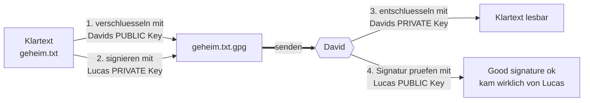

# Übung: Eine Datei asymmetrisch verschlüsseln (Tandem-Arbeit)

**Modul M231 – Datenschutz und Informationssicherheit**

> **Lernziel:** Ich kann eine Datei mit einem asymmetrischen Verfahren gezielt für
> eine bestimmte Empfängerin oder einen bestimmten Empfänger verschlüsseln und sie
> zusätzlich signieren.

|               |                                                                                                    |
| ------------- | -------------------------------------------------------------------------------------------------- |
| **Tandem**    | Lucas ⇄ **David**                                                                                  |
| **Werkzeug**  | GnuPG 2.4 (Kommandozeile) – austauschbar mit *gpg4win/Kleopatra* (Windows) und *GPG Suite* (macOS) |
| **Verfahren** | OpenPGP (asymmetrisch: RSA bzw. ECC/Ed25519)                                                       |

---

## 1. Kurztheorie: asymmetrische Verschlüsselung

Beim **asymmetrischen** Verfahren besitzt jede Person nicht ein einzelnes Passwort,
sondern ein **Schlüsselpaar** aus zwei zusammengehörenden Teilen:

| Schlüssel | Wer besitzt ihn? | Verwendung |
|---|---|---|
| **privater Schlüssel** (*private key*) | ausschliesslich ich selbst, durch eine Passphrase geschützt | Entschlüsseln und Signieren |
| **öffentlicher Schlüssel** (*public key*) | darf frei weitergegeben werden | Verschlüsseln an mich und Prüfen meiner Signatur |

Der Trick: Was mit dem **öffentlichen** Schlüssel verschlüsselt wurde, kann nur noch
mit dem dazugehörigen **privaten** Schlüssel geöffnet werden. Beim Signieren läuft es
genau umgekehrt. Aus diesen beiden Richtungen entstehen zwei Anwendungen, die wir in
dieser Übung **zusammen** einsetzen:

| Ziel | Schutzziel | Ich verwende … | Der Partner prüft bzw. öffnet mit … |
|---|---|---|---|
| **Verschlüsseln** (geheim halten) | Vertraulichkeit | **Davids** *öffentlichen* Schlüssel | Davids *privatem* Schlüssel |
| **Signieren** (Echtheit belegen) | Authentizität und Integrität | **meinem** *privaten* Schlüssel | meinem *öffentlichen* Schlüssel |

> **Merke:** Verschlüsselt wird immer *für den Empfänger* (dessen Public Key),
> signiert wird immer *mit einem selbst* (eigener Private Key).



Warum eignet sich das gerade für einen **bestimmten Empfänger**? Weil ausschliesslich
David über seinen privaten Schlüssel verfügt, kann auch nur er die Datei wieder öffnen.
Wird die Datei auf dem Transportweg abgefangen, bleibt sie für alle anderen wertloser
Datenmüll. Die zusätzliche **Signatur** gibt David die Gewissheit, dass die Datei
tatsächlich von mir stammt und unterwegs nicht verändert wurde.

---

## 2. Wahl des Werkzeugs

Für Public-Key-Kryptografie auf Basis von **OpenPGP** sind vor allem diese Programme
verbreitet:

| Werkzeug | Plattform | Bedienung |
|---|---|---|
| **GnuPG (`gpg`)** ← *gewählt* | macOS / Linux / Windows | Kommandozeile |
| **gpg4win** (GUI *Kleopatra*) | Windows | grafisch |
| **GPG Suite** | macOS | grafisch mit Mail-Anbindung |

**Entscheidung: GnuPG.** Begründung: GnuPG ist die freie Referenz-Implementierung des
OpenPGP-Standards und daher vollständig **interoperabel**. Ob David also Kleopatra unter
Windows oder GPG unter macOS verwendet, spielt keine Rolle – die Schlüssel und die
erzeugten Dateien (`.asc` bzw. `.gpg`) lassen sich problemlos untereinander austauschen.
Zudem ist GnuPG bei mir bereits vorhanden (`gpg (GnuPG) 2.4.x`).

**Installation, falls noch nicht vorhanden:**
```bash
# macOS (Homebrew)
brew install gnupg
# Linux (Debian/Ubuntu)
sudo apt install gnupg
# Windows: Installer von https://www.gpg4win.org/ herunterladen
# danach pruefen:
gpg --version
```

---

## Schritt 1 – Eigenes Schlüsselpaar erzeugen

```bash
gpg --full-generate-key
```

GnuPG stellt dazu einige Fragen. Sinnvolle Antworten:

| Abfrage | Antwort                                                             | Begründung |
|---|---|---|
| *Kind of key* | **`9` (ECC, sign and encrypt)**, danach Kurve **`1` (Curve 25519)** | modern, schnell und mit kurzen Schlüsseln – passend zu Davids Schlüssel. *(Alternative: `1` RSA and RSA mit Länge `4096`.)* |
| *Key valid for* | **`2y`** (zwei Jahre)                                               | ein Ablaufdatum ist Pflicht guter Schlüsselhygiene |
| *Real name* | `Lucas`                                                             | meine Identität |
| *Email address* | `lucasweisshaar@googlemail.com`                                     | ordnet den Schlüssel meiner Adresse zu |
| *Comment* | *(leer lassen)*                                                     | nicht nötig |
| *Passphrase* | **starke Passphrase**                                               | schützt den privaten Schlüssel, falls jemand die Datei stiehlt |

> **Hinweis:** Die Passphrase ist nicht der private Schlüssel selbst, sondern das
> Passwort, mit dem der private Schlüssel auf der Festplatte verschlüsselt liegt. Ohne
> sie kann mich niemand imitieren, selbst wenn er physisch an meinen Rechner kommt.
> Deshalb gut merken oder im Passwortmanager ablegen.

**Kontrolle – erzeugtes Schlüsselpaar anzeigen:**
```bash
gpg --list-secret-keys --keyid-format long
```
Beispiel-Ausgabe (deine Werte sind andere):
```
sec   ed25519/XXXXXXXXXXXXXXXX 2026-07-03 [SC] [expires: 2028-07-02]
      <DEIN 40-stelliger FINGERPRINT>
uid                 [ultimate] Lucas <lucasweisshaar@googlemail.com>
ssb   cv25519/........ 2026-07-03 [E]
```
Kurz erklärt: `sec` = privater (geheimer) Schlüssel, `uid` = Identität,
`ssb` = Unterschlüssel fürs Verschlüsseln.

> **Beleg:** Mein Fingerprint lautet `__________________________________`

---

## Schritt 2 – Eigenen Public Key exportieren und David geben

David benötigt meinen **öffentlichen** Schlüssel, damit er (a) mir verschlüsselt
antworten und (b) meine Signaturen prüfen kann. Exportiert wird ausdrücklich nur der
öffentliche Teil:

```bash
gpg --armor --export lucasweisshaar@googlemail.com > Lucas_public.asc
```

- `--export` gibt ausschliesslich den **öffentlichen** Schlüssel aus; der private bleibt geschützt in `~/.gnupg`.
- `--armor` erzeugt statt Binärdaten lesbaren ASCII-Text (`-----BEGIN PGP PUBLIC KEY BLOCK-----`), praktisch für E-Mail oder Chat.

Der Anfang sieht ungefähr so aus (Beispielwert):
```
-----BEGIN PGP PUBLIC KEY BLOCK-----

mQINBGa1cZ0BEADPd3xk7Qv2Lm9EXAMPLEonlyPLACEHOLDERdata...
```

Diese Datei `Lucas_public.asc` schicke ich David (per E-Mail, Teams, USB und so weiter).
Das ist gefahrlos, denn ein öffentlicher Schlüssel ist genau zum Verteilen gedacht.

> **Achtung:** Niemals `--export-secret-keys` verschicken oder ins Repository legen –
> das wäre der **geheime** Schlüssel.

---

## Schritt 3 – Davids Public Key importieren

Davids öffentlicher Schlüssel liegt bereits im Projektordner
(`David_0xA7C3F92D18B4E065_public.asc`). In den eigenen Schlüsselbund aufnehmen:

```bash
gpg --import David_0xA7C3F92D18B4E065_public.asc
```
Erwartete Ausgabe:
```
gpg: key A7C3F92D18B4E065: public key "David" imported
gpg: Total number processed: 1
gpg:               imported: 1
```

---

## Schritt 4 – Davids Fingerprint prüfen und den Schlüssel beglaubigen

Dies ist der **sicherheitskritischste** Schritt und zugleich die Voraussetzung dafür,
dass ich später überhaupt *belegen* kann, dass etwas wirklich von David stammt. Ein frisch
importierter Schlüssel gilt zunächst als **unbekannt**: GnuPG kann nicht wissen, ob die
Datei wirklich von David kam oder von einem Angreifer untergeschoben wurde
(*Man-in-the-Middle*).

**1) Fingerprint anzeigen:**
```bash
gpg --fingerprint David
```
```
pub   ed25519 2026-06-30 [SC] [expires: 2029-06-30]
      9D42 6B1F C08A 33E7 5DA1  2F84 A7C3 F92D 18B4 E065
uid           [ unknown] David
```

**2) Diesen Fingerprint über einen zweiten, unabhängigen Kanal mit David abgleichen** –
persönlich, per Telefon oder Videoanruf. Nur wenn beide Seiten exakt
`9D42 6B1F … 18B4 E065` lesen, gehört der Schlüssel tatsächlich David.

**3) Schlüssel beglaubigen** (ich bestätige: „Ich habe geprüft, dieser Schlüssel gehört David"):
```bash
gpg --sign-key A7C3F92D18B4E065
```
Mit `y` bestätigen. Anschliessend steht der Schlüssel nicht mehr auf `[unknown]`,
sondern gilt als vertrauenswürdig.

> **Wichtig:** Ohne diesen Schritt scheitert das Verschlüsseln in Schritt 5 mit der
> Meldung `There is no assurance this key belongs to the named user … Unusable public key`.
> Genau deshalb ist das Beglaubigen ein fester Bestandteil des Ablaufs.

> **Beleg:** Davids Fingerprint gemeinsam abgeglichen am `03.07.2026` (erledigt)

---

## Schritt 5 – Geheimdatei verschlüsseln **und** signieren

Zuerst eine kleine Testdatei anlegen:
```bash
echo "Streng geheim - nur fuer David! Codewort: Eisbaer-231" > geheim.txt
```

Nun in **einem einzigen** Befehl für David verschlüsseln und mit dem eigenen Schlüssel signieren:
```bash
gpg --output geheim.txt.gpg \
    --recipient David \
    --local-user lucasweisshaar@googlemail.com \
    --sign --encrypt geheim.txt
```

| Option | Bedeutung |
|---|---|
| `--recipient David` (`-r`) | **für wen** verschlüsselt wird → mit **Davids Public Key** |
| `--local-user lucas…` (`-u`) | **wer** signiert → mit **meinem privaten Key** (GnuPG fragt nach meiner Passphrase) |
| `--sign` (`-s`) | Datei signieren (Echtheit) |
| `--encrypt` (`-e`) | Datei verschlüsseln (Geheimhaltung) |
| `--output … .gpg` (`-o`) | Name der Zieldatei |

> Wird die verschlüsselte Datei als **Text** benötigt (etwa zum Einfügen in eine E-Mail),
> ergänzt man `--armor`; das Ergebnis heisst dann `geheim.txt.asc`.

**Kontrolle:** `geheim.txt.gpg` ist nun binärer, unleserlicher Inhalt. Öffnet man sie
testweise, erkennt man nichts mehr – und genau das ist erwünscht: Nur David kann sie
wieder lesbar machen.

Danach `geheim.txt.gpg` an David übermitteln.

---

## Schritt 6 – Übermittlung

Die verschlüsselte Datei (`.gpg` oder `.asc`) an David senden – als E-Mail-Anhang, über
Teams, per USB-Stick und so weiter. Da der Inhalt bereits verschlüsselt ist, spielt die
Sicherheit des Transportwegs praktisch keine Rolle mehr.

---

## Schritt 7 – Empfangenes von David entschlüsseln und Signatur prüfen *(der Beleg)*

Umgekehrt verschlüsselt David eine Datei **mit meinem Public Key** und signiert sie mit
**seinem** privaten Key. Anschliessend schickt er sie mir (etwa als `von_david.gpg`).
Ich öffne die Datei:

```bash
gpg --output von_david.txt --decrypt von_david.gpg
```

GnuPG erledigt dabei **zwei** Dinge gleichzeitig und gibt etwa Folgendes aus:
```
gpg: encrypted with cv25519 key, ID ........, created 2026-07-03
      "Lucas <lucasweisshaar@gmail.com>"
gpg: Signature made Fri Jul 03 14:12:07 2026 CEST
gpg:                using EDDSA key 9D426B1FC08A33E75DA12F84A7C3F92D18B4E065
gpg: Good signature from "David" [full]
```

**Das ist der eigentliche Beleg.** Zeile für Zeile:

| Ausgabe                           | Bedeutung |
|---|---|
| `encrypted with … "Lucas"`        | Die Datei war **für mich** verschlüsselt – nur mein privater Schlüssel konnte sie öffnen → **Vertraulichkeit** bestätigt. |
| `using EDDSA key 9D42…E065`       | Geprüft wurde gegen **Davids** Fingerprint, den ich in Schritt 4 verifiziert habe. |
| **`Good signature from "David"`** | Die Signatur passt mathematisch zu Davids öffentlichem Schlüssel → die Datei stammt **wirklich von David** (**Authentizität**) und wurde **nicht verändert** (**Integrität**). |

> **Wichtig:** Stünde dort `BAD signature`, wäre die Datei manipuliert oder gefälscht.
> Erscheint eine Meldung wie `WARNING: This key is not certified…`, dann wurde Davids
> Schlüssel nicht beglaubigt (Schritt 4). Die Signatur ist in diesem Fall zwar rechnerisch
> gültig, doch GnuPG warnt, weil es die Echtheit des Schlüssels nicht selbst bezeugen kann.


---

## 8. Was belegt die Übung? (Schutzziele im Überblick)

| Schutzziel | Erreicht durch | Erkennbar an |
|---|---|---|
| **Vertraulichkeit** (nur David liest mit) | Verschlüsselung mit Davids *Public Key* | nur sein privater Key entschlüsselt; sonst bleibt die Datei unlesbar |
| **Authentizität** (es kam wirklich von ihm) | Signatur mit seinem *Private Key* | `Good signature from "David"` |
| **Integrität** (nichts wurde verändert) | dieselbe Signatur | `Good signature` (bei Änderung → `BAD`) |

---

## 9. Sicherheit – was ins Repository darf und was nicht

Dieses Repository liegt **öffentlich auf GitHub**. Deshalb gilt strikt:

| Darf committet werden | Niemals committen |
|---|---|
| `README.md` (diese Dokumentation) | privater/geheimer Schlüssel (`*secret*.asc`, Export aus `gpg --export-secret-keys`) |
| eigener **öffentlicher** Schlüssel `Lucas_public.asc` | die **Klartext**-Geheimdatei `geheim.txt` |
| Davids **öffentlicher** Schlüssel `David_*.asc` | Passphrase oder sonstige Passwörter |
| die **verschlüsselte** Datei `geheim.txt.gpg` (ist bereits verschlüsselt) | Revocation-Zertifikat (`*.rev`) |
| Screenshots der `Good signature` im Ordner `belege/` | der gesamte `~/.gnupg`-Ordner |

Die mitgelieferte **`.gitignore`** verhindert, dass die gefährlichen Dateien versehentlich
eingecheckt werden.

**Weitere Empfehlungen:**
- Das **Revocation-Zertifikat**, das GnuPG automatisch unter `~/.gnupg/openpgp-revocs.d/` ablegt, sicher aufbewahren. Damit lässt sich der Schlüssel für ungültig erklären, falls er kompromittiert wird.
- Den privaten Schlüssel niemals weitergeben. Geteilt wird immer ausschliesslich die Datei `*_public.asc`.

---

## 10. Spickzettel (Cheat Sheet)

```bash
# Schluesselpaar erstellen
gpg --full-generate-key

# eigene bzw. fremde Schluessel auflisten
gpg --list-secret-keys --keyid-format long
gpg --list-keys --keyid-format long

# eigenen Public Key exportieren (an Partner senden)
gpg --armor --export lucasweisshaar@googlemail.com > Lucas_public.asc

# Partner-Public-Key importieren, pruefen und beglaubigen
gpg --import David_0xA7C3F92D18B4E065_public.asc
gpg --fingerprint David
gpg --sign-key A7C3F92D18B4E065

# verschluesseln UND signieren (fuer David)
gpg -o geheim.txt.gpg -r David -u lucasweisshaar@googlemail.com -se geheim.txt

# entschluesseln UND Signatur pruefen (Empfangenes von David)
gpg -o von_david.txt -d von_david.gpg
```

---

## 11. Glossar

| Begriff | Bedeutung |
|---|---|
| **Asymmetrisch** | Verfahren mit einem Schlüssel**paar** (öffentlich und privat) – im Gegensatz zu *symmetrisch*, wo beide Seiten dasselbe Passwort teilen. |
| **OpenPGP** | offener Standard für die Verschlüsselung von E-Mails und Dateien; GnuPG ist eine seiner Implementierungen. |
| **Public / Private Key** | öffentlicher Schlüssel (zum Teilen) bzw. privater Schlüssel (geheim). |
| **Fingerprint** | eindeutiger „Fingerabdruck" eines Schlüssels (40 Hex-Zeichen) zur Echtheitsprüfung. |
| **Signatur** | mit dem privaten Schlüssel erzeugter Echtheitsnachweis, überprüfbar mit dem öffentlichen Schlüssel. |
| **Passphrase** | Passwort, das den privaten Schlüssel auf der Festplatte schützt. |
| **Revocation-Zertifikat** | Widerrufs-Zertifikat, um einen Schlüssel für ungültig zu erklären. |
| **Armor (`--armor`)** | Ausgabe als ASCII-Text anstatt binär (`.asc`). |
